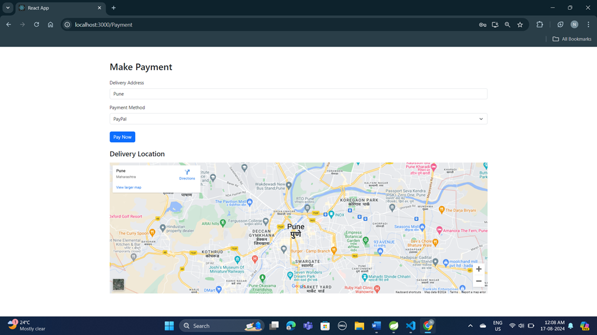

# Handy Mart - Web Portal

  &emsp;
  &emsp;
  &emsp;
  &emsp;
  &emsp;
  &emsp;
  &emsp;
  &emsp;
  

 

<a href="https://github.com/NilayPawale/HandyMart/tree/main/Web%20Portal">Handy Mart Web Portal</a>

Handy-Mart is an e-commerce platform catering to a diverse customer base, offering a variety of products including electronics, fashion, home goods, and groceries. The web application is built using modern web technologies to ensure responsiveness, accessibility, and performance. The project will focus on delivering an intuitive user interface, robust backend services, and secure payment processing.

# Features

1. Customer Account Management
2. Product Catelogue
3. Shopping Cart
4. Order Mangement
5. Payment Gateway
6. Feedback System
7. Email Authentication
8. Google Map Integration For Address

## Approach Used

1. Code First
2. Reactive(Declarative) Programming
3. KISS
4. DRY

#### HTTP Communication Protocol

#### 3 - Tier Architecture

#### Monolithic Backend Application Architecture

## Platform used

1. JDK-11
2. Maven 4.0.0
3. Springframework 2.7.3
4. Spring Boot Web
5. Spring Security 
6. Spring Data JPA
7. React 17.0.2
8. React-Router-Dom 6.2.2
9. React-i18next

## Prerequisites to start Application on your machine

1. JDK-11 or latest
2. MySQL
3. Maven
4. Nodejs
5. React App

## 3rd Party API Used

#### Get Address details - Google Map

<iframe
  width="600"
  height="450"
  style="border:0"
  loading="lazy"
  allowfullscreen
  referrerpolicy="no-referrer-when-downgrade"
  src="https://www.google.com/maps/embed/v1/place?key=API_KEY
    &q=Space+Needle,Seattle+WA">
</iframe>

## Entity Relationship Diagram

## Data Flow Diagram

1. Customer Data Flow Diagram

2. Vendor Data Flow Diagram

3. Admin Data Flow Diagram

## Use Case Diagram

## Activity Diagram

1. Admin Activity Diagram

2. Customer Activity Diagram

3. Vendor Activity Diagram

## Class Diagram

## Web Portal Images

1. Homepage

2. Login Page

3. Customer Registration Page

4. Vendor Registration Page

5. Admin Login Page (For Administrating Vendor Registrations)

6. Customer Login Page (After Login)

7. Customer Cart Page

8. Customer Payment with Location Page

9. Customer Payment Success

10. Customer Payment Details

11. Customer Track Order

12. Customer Feedback and Review

13. Vendor Login

14. Vendor Add Product Page

15. Vendor Profile

## Future Scope

1. Client & Server Side Validation
2. Exception handling
3. All Pages of UI in Marathi & other Language
4. WhatsApp Business API Integration

## Support

For support, Email nilaypawale@gmail.com
